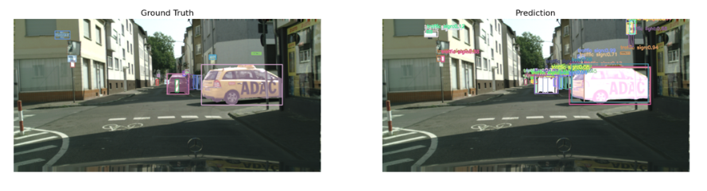

# Mask R-CNN (Meta Reimplementation) – Cityscapes Evaluation

  
*Ground Truth (left) vs Prediction (right)*

## Overview

This project is a full reimplementation of the **Mask R-CNN** architecture (originally from Meta/Facebook AI Research) using **PyTorch**. The model has been optimized for training in constrained environments like **Kaggle**. It is trained and evaluated on the **Cityscapes** dataset for both object detection (bounding box) and instance segmentation tasks.

## Key Features

- Full custom implementation of Mask R-CNN: ResNet + FPN backbone, RPN, ROI Align, classification and mask heads.
- Memory-optimized for Kaggle/Colab environments.
- COCO-style evaluation using `pycocotools`.
- Side-by-side prediction vs. ground truth visualizations.
- Strong performance on Cityscapes validation set.

---

## Evaluation Results

### Bounding Box (BBox) – COCO Metrics

| Metric                             | Value |
|------------------------------------|-------|
| AP @[ IoU=0.50:0.95 ]              | 0.351 |
| AP @[ IoU=0.50 ]                   | 0.592 |
| AP @[ IoU=0.75 ]                   | 0.355 |
| AP (small / medium / large)        | 0.089 / 0.291 / 0.515 |
| AR @[ maxDets=100 ]                | 0.464 |

### Segmentation (Segm) – COCO Metrics

| Metric                             | Value |
|------------------------------------|-------|
| AP @[ IoU=0.50:0.95 ]              | 0.338 |
| AP @[ IoU=0.50 ]                   | 0.580 |
| AP @[ IoU=0.75 ]                   | 0.335 |
| AP (small / medium / large)        | 0.093 / 0.262 / 0.482 |
| AR @[ maxDets=100 ]                | 0.452 |

**Best validation model at Epoch 10 with Bbox mAP = 0.3512**

---

## Requirements

Install the following dependencies before running the code:

```bash
python==3.10
torch>=2.0
torchvision>=0.15
numpy
matplotlib
opencv-python
albumentations
scikit-learn
tqdm
pycocotools
jupyter  # Optional
